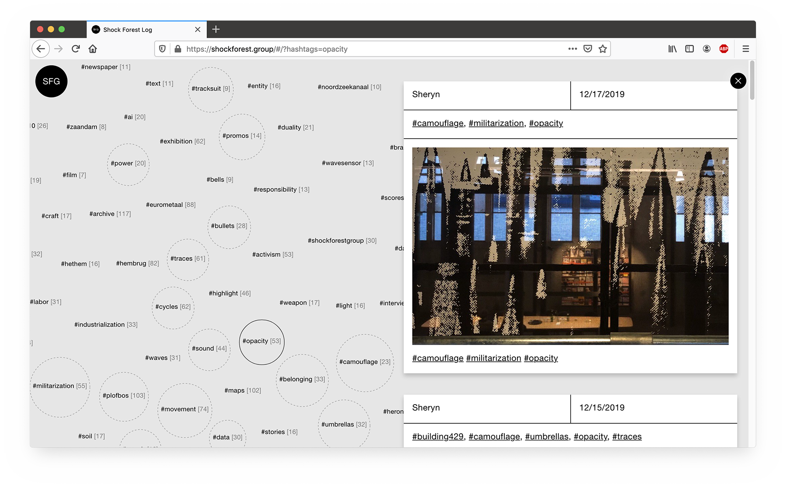

# Shock Forest Log

The Shock Forest Log is the visual archive of the [Shock Forest Group](https://hethem.nl/en/Chapter-Two/Door-Nicolas-Jaar-Shock-Forest-Group):

> From September 11, 2019 through December 21, 2019, a group of researchers, artists, and
> activists called the [#shockforestgroup](https://shockforest.group/#/?hashtags=shockforestgroup) lived and worked at [#hethem](https://shockforest.group/#/?hashtags=hethem),
> a cultural institution in Zaandam, Netherlands. Het HEM is located in the former 0,50 caliber
> [#bullets](https://shockforest.group/#/?hashtags=bullets) factory on the ex-military [#hembrug](https://shockforest.group/#/?hashtags=hembrug) terrain. Although
> the building was built in 1956, the company that occupied it, Artillerie Inrichtingen,
> also known as [#ai](https://shockforest.group/#/?hashtags=ai), had been supplying weapons
> for Dutch [#colonialism](https://shockforest.group/#/?hashtags=colonialism) since 1679. In 1973, AI split, and the 0,50 factory
> became property of the new company [#eurometaal](https://shockforest.group/#/?hashtags=eurometaal).

Read more about the Shock Forest Log on the [About page](https://shockforest.group/#/about).

## Usage

Visit [shockforest.group](https://shockforest.group) to view the archive.

To run the Shock Forest Log locally, you need to install Node.js and npm.

First, clone this repository:

    git clone https://github.com/bertspaan/shock-forest-log.git

Then, install the dependencies:

    npm install

To run the Log on http://localhost:8080:

    npm run serve

## Shock Forest Bot

The messages, hashtags and media files shown in the Shock Forest Log were collected by the [Shock Forest Bot](https://github.com/bertspaan/shock-forest-bot), a [Telegram bot](https://core.telegram.org/bots) that collected and archived messages from the Shock Forest Group’s Telegram chat group.
